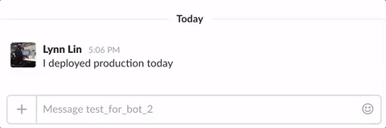
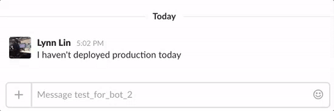

# Slack Bot: Release Reminder

When someone calls the bot, the bot will tell you who is going to deploy today.

## Used APIs

| API | Usage |
| --- | ----- |
| groups.history | retrieve the message history in the private channel to see if the deploying message is mentioned |
| users.info | get the user who mentioned the deploying message |
| chat.postMessage | tell the channel who is going to deploy next |

## Demo

#### Someone have deployed today

#### Nobody have not deployed today

